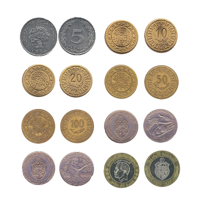

# TND-Identifier
An application that uses machine learning algorithms (Tensorflow) to classify images of Tunisian currency

## Dependencies
    python3.x
    tensorflow
    opencv-python
    sklearn
    numpy

## Run the app
    $ <install> python3
    $ pip3 install -r requirements.txt
    $ python3 predict.py <image.xyz>

## Docker deployment
Easy deployment with [docker](docker/)

